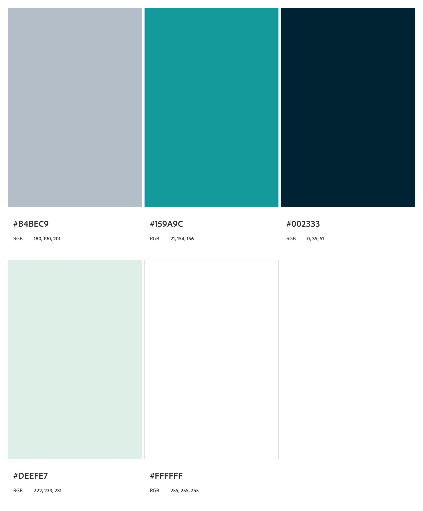

<h3 align="center"> Universidad Peruana de Ciencias Aplicadas </h3>

<h3 align="center"> Ingeniería de Software </h3>
<h3 align="center"> Ciclo 2024 - 2 </h3>

 

  

 
<h3 align="center"> Desarrollo de Aplicaiones Web - SW52 </h3>
<h3 align="center"> Profesor del Curso: Juan Carlos Tinoco Licas </h3>
<h3 align="center"> "INFORME DE TRABAJO FINAL"</h3>
<h3 align="center"> EMPRESA DE INICIO: nombre </h3>

<h3 align="center"> PRODUCTO: "NOMBRE"</h3>

| Miembro                                |    Código     |
| :------------------------------------- | :-----------: |
| Meza Camayo, Lynn Jeeferzon            | U20201C320    |
| Barturen Guzman, Alejandro Nicolas     | U202214406    |
| Morales Sosa, Arnold Gabriel           | U201822516    |
| Braithuaite Toledo, Gabriel Anthony    | U20201E889    |
| Araujo Ingunza, Renzo José             | U202113612    |
| Lapa de la Cruz, Gabriel Omar          | U202216831    |

<h3 align="center"> 2024 </h3>

 

# **Registro de Versiones del Informe**

<table BORDER>
    <tr>
        <td>VERSION</td>
        <td>FECHA</td>
        <td> AUTOR </td>
        <td>DESCRIPCION DE MODIFICACION</td>
    </tr>
    <tr>
        <td>01</td>
        <td>23/08/2024</td>
        <td> Lynn Meza Camayo </td>
        <td>Formato del documento</td>
    </tr>
    <tr>
        <td></td>
        <td></td>
        <td></td>
        <td></td>
    </tr>
    <tr>
        <td></td>
        <td></td>
        <td></td>
        <td></td>
    </tr>
</table>

# **Project Report Collaboration Insights**

URL del repositorio de la Organizacion: <https://github.com/Grupo1-AplicacionesWeb-SW52/informe-trabajo>

# **Contenido**
### Tabla de contenidos
- [**Registro de Versiones del Informe**](#registro-de-versiones-del-informe)
- [**Project Report Collaboration Insights**](#project-report-collaboration-insights)
- [**Contenido**](#contenido)
    - [Tabla de contenidos](#tabla-de-contenidos)
- [**Student Outcome**](#student-outcome)
- [ **Capítulo I: Introducción** ](#-capítulo-i-introducción-)
  - [**1.1. Startup Profile**](#11-startup-profile)
    - [**1.1.1. Descripción de la Startup**](#111-descripción-de-la-startup)
    - [**1.1.2. Perfiles de integrantes del equipo**](#112-perfiles-de-integrantes-del-equipo)
  - [**1.2. Solution Profile**](#12-solution-profile)
    - [**1.2.1 Antecedentes y problemática**](#121-antecedentes-y-problemática)
    - [What (¿Qué?)](#what-qué)
    - [Who (¿Quién?)](#who-quién)
    - [Where (¿Dónde?)](#where-dónde)
    - [When (¿Cuándo?)](#when-cuándo)
    - [Why (¿Por qué?)](#why-por-qué)
    - [How (¿Cómo?)](#how-cómo)
    - [How much (¿Cuánto?)](#how-much-cuánto)
    - [**1.2.2 Lean UX Process**](#122-lean-ux-process)
    - [**1.2.2.1. Lean UX Problem Statements**](#1221-lean-ux-problem-statements)
    - [**1.2.2.2. Lean UX Assumptions**](#1222-lean-ux-assumptions)
    - [**1.2.2.3. Lean UX Hypothesis Statements**](#1223-lean-ux-hypothesis-statements)
    - [**1.2.2.4. Lean UX Canvas**](#1224-lean-ux-canvas)
  - [**1.3. Segmentos objetivo**](#13-segmentos-objetivo)
- [ **Capítulo II: Requirements Elicitation \& Analysis**](#-capítulo-ii-requirements-elicitation--analysis)
  - [**2.1. Competidores**](#21-competidores)
    - [**2.1.1. Análisis competitivo**](#211-análisis-competitivo)
    - [**2.1.2. Estrategias y tácticas frente a competidores**](#212-estrategias-y-tácticas-frente-a-competidores)
  - [**2.2. Entrevistas**](#22-entrevistas)
    - [**2.2.1. Diseño de entrevistas**](#221-diseño-de-entrevistas)
    - [**2.2.2. Registro de entrevistas**](#222-registro-de-entrevistas)
    - [**2.2.3. Análisis de entrevistas**](#223-análisis-de-entrevistas)
  - [**2.3. Needfinding**](#23-needfinding)
    - [**2.3.1. User Personas**](#231-user-personas)
    - [**2.3.2. User Task Matrix**](#232-user-task-matrix)
    - [**2.3.3. User Journey Mapping**](#233-user-journey-mapping)
    - [**2.3.4. Empathy Mapping**](#234-empathy-mapping)
    - [**2.3.5. As-is Scenario Mapping**](#235-as-is-scenario-mapping)
  - [**2.4. Ubiquitous Language**](#24-ubiquitous-language)
- [ **Capítulo III: Requirements Specification**](#-capítulo-iii-requirements-specification)
  - [**3.1. To-Be Scenario Mapping**](#31-to-be-scenario-mapping)
  - [**3.2. User Stories**](#32-user-stories)
  - [**3.3. Impact Mapping**](#33-impact-mapping)
  - [**3.4. Product Backlog**](#34-product-backlog)
- [**Capítulo IV: Product Design**](#capítulo-iv-product-design)
  - [**4.1. Style Guidelines**](#41-style-guidelines)
    - [**4.1.1. General Style Guidelines**](#411-general-style-guidelines)
    - [**4.1.2. Web Style Guidelines**](#412-web-style-guidelines)
  - [**4.2. Information Architecture**](#42-information-architecture)
    - [**4.2.1. Organization Systems**](#421-organization-systems)
    - [**4.2.2. Labeling Systems**](#422-labeling-systems)
    - [**4.2.3. SEO Tags and Meta Tags**](#423-seo-tags-and-meta-tags)
    - [**4.2.4. Searching Systems**](#424-searching-systems)
    - [**4.2.5. Navigation Systems**](#425-navigation-systems)
  - [**4.3. Landing Page UI Design**](#43-landing-page-ui-design)
    - [**4.3.1. Landing Page Wireframe**](#431-landing-page-wireframe)
    - [**4.3.2. Landing Page Mock-up**](#432-landing-page-mock-up)
  - [**4.4. Web Applications UX/UI Design**](#44-web-applications-uxui-design)
    - [**4.4.1. Web Applications Wireframes**](#441-web-applications-wireframes)
    - [**4.4.2. Web Applications Wireflow Diagrams**](#442-web-applications-wireflow-diagrams)
    - [**4.4.3. Web Applications Mock-ups**](#443-web-applications-mock-ups)
    - [**4.4.4. Web Applications User Flow Diagrams**](#444-web-applications-user-flow-diagrams)
  - [**4.5. Web Applications Prototyping**](#45-web-applications-prototyping)
  - [**4.6. Domain-Driven Software Architecture**](#46-domain-driven-software-architecture)
    - [**4.6.1. Software Architecture Context Diagram**](#461-software-architecture-context-diagram)
    - [**4.6.2. Software Architecture Container Diagrams**](#462-software-architecture-container-diagrams)
    - [**4.6.3. Software Architecture Components Diagrams**](#463-software-architecture-components-diagrams)
  - [**4.7. Software Object-Oriented Design**](#47-software-object-oriented-design)
    - [**4.7.1. Class Diagrams**](#471-class-diagrams)
    - [**4.7.2. Class Dictionary**](#472-class-dictionary)
  - [**4.8. Database Design**](#48-database-design)
    - [**4.8.1. Database Diagram**](#481-database-diagram)
- [**Capítulo V: Product Implementation, Validation \& Deployment**](#capítulo-v-product-implementation-validation--deployment)
  - [**5.1. Software Configuration Management**](#51-software-configuration-management)
    - [**5.1.1. Software Development Environment Configuration**](#511-software-development-environment-configuration)
    - [**5.1.2. Source Code Management**](#512-source-code-management)
    - [**5.1.3. Source Code Style Guide \& Conventions**](#513-source-code-style-guide--conventions)
    - [**5.1.4. Software Deployment Configuration**](#514-software-deployment-configuration)
  - [**5.2. Landing Page, Services \& Applications Implementation**](#52-landing-page-services--applications-implementation)
    - [**5.2.1. Sprint 1**](#521-sprint-1)
        - [**5.2.1.1. Sprint Planning 1**](#5211-sprint-planning-1)
        - [**5.2.1.2. Sprint Backlog 1**](#5212-sprint-backlog-1)
        - [**5.2.1.3. Development Evidence for Sprint Review**](#5213-development-evidence-for-sprint-review)
        - [**5.2.1.4. Testing Suite Evidence for Sprint Review**](#5214-testing-suite-evidence-for-sprint-review)
        - [**5.2.1.5. Execution Evidence for Sprint Review**](#5215-execution-evidence-for-sprint-review)
        - [**5.2.1.6. Services Documentation Evidence for Sprint Review**](#5216-services-documentation-evidence-for-sprint-review)
        - [**5.2.1.7. Software Deployment Evidence for Sprint Review**](#5217-software-deployment-evidence-for-sprint-review)
        - [**5.2.1.8. Team Collaboration Insights during Sprint**](#5218-team-collaboration-insights-during-sprint)
    - [**5.2.2. Sprint 2**](#522-sprint-2)
        - [**5.2.2.1. Sprint Planning 2**](#5221-sprint-planning-2)
        - [**5.2.2.2. Sprint Backlog 2**](#5222-sprint-backlog-2)
        - [**5.2.2.3. Development Evidence for Sprint Review**](#5223-development-evidence-for-sprint-review)
        - [**5.2.2.4. Testing Suite Evidence for Sprint Review**](#5224-testing-suite-evidence-for-sprint-review)
        - [**5.2.2.5. Execution Evidence for Sprint Review**](#5225-execution-evidence-for-sprint-review)
        - [**5.2.2.6. Services Documentation Evidence for Sprint Review**](#5226-services-documentation-evidence-for-sprint-review)
        - [**5.2.2.7. Software Deployment Evidence for Sprint Review**](#5227-software-deployment-evidence-for-sprint-review)
        - [**5.2.2.8. Team Collaboration Insights during Sprint**](#5228-team-collaboration-insights-during-sprint)
    - [**5.2.3. Sprint 3**](#523-sprint-3)
        - [**5.2.3.1. Sprint Planning 3**](#5231-sprint-planning-3)
        - [**5.2.3.2. Sprint Backlog 3**](#5232-sprint-backlog-3)
        - [**5.2.3.3. Development Evidence for Sprint Review**](#5233-development-evidence-for-sprint-review)
        - [**5.2.3.4. Testing Suite Evidence for Sprint Review**](#5234-testing-suite-evidence-for-sprint-review)
        - [**5.2.3.5. Execution Evidence for Sprint Review**](#5235-execution-evidence-for-sprint-review)
        - [**5.2.3.6. Services Documentation Evidence for Sprint Review**](#5236-services-documentation-evidence-for-sprint-review)
        - [**5.2.3.7. Software Deployment Evidence for Sprint Review**](#5237-software-deployment-evidence-for-sprint-review)
        - [**5.2.3.8. Team Collaboration Insights during Sprint**](#5238-team-collaboration-insights-during-sprint)
    - [**5.2.4. Sprint 4**](#524-sprint-4)
        - [**5.2.4.1. Sprint Planning 4**](#5241-sprint-planning-4)
        - [**5.2.4.2. Sprint Backlog 4**](#5242-sprint-backlog-4)
        - [**5.2.4.3. Development Evidence for Sprint Review**](#5243-development-evidence-for-sprint-review)
        - [**5.2.4.4. Testing Suite Evidence for Sprint Review**](#5244-testing-suite-evidence-for-sprint-review)
        - [**5.2.4.5. Execution Evidence for Sprint Review**](#5245-execution-evidence-for-sprint-review)
        - [**5.2.4.6. Services Documentation Evidence for Sprint Review**](#5246-services-documentation-evidence-for-sprint-review)
        - [**5.2.4.7. Software Deployment Evidence for Sprint Review**](#5247-software-deployment-evidence-for-sprint-review)
        - [**5.2.4.8. Team Collaboration Insights during Sprint**](#5248-team-collaboration-insights-during-sprint)
  - [**5.3. Validation Interviews**](#53-validation-interviews)
    - [**5.3.1. Diseño de Entrevistas**](#531-diseño-de-entrevistas)
    - [**5.3.2. Registro de Entrevistas**](#532-registro-de-entrevistas)
    - [**5.3.3. Evaluaciones según heurísticas**](#533-evaluaciones-según-heurísticas)
  - [**5.4. Video About-the-Product**](#54-video-about-the-product)
- [**Conclusiones**](#conclusiones)
- [**Conclusiones y recomendaciones**](#conclusiones-y-recomendaciones)
- [**Video About-the-Team**](#video-about-the-team)
- [**Bibliografía**](#bibliografía)
- [**Anexos**](#anexos)

# **Student Outcome**

#  **Capítulo I: Introducción** 
## **1.1. Startup Profile**
### **1.1.1. Descripción de la Startup**

### **1.1.2. Perfiles de integrantes del equipo**
## **1.2. Solution Profile**

### **1.2.1 Antecedentes y problemática**
### What (¿Qué?)
**Problema:** La creciente dificultad para acceder a cuidadores calificados y confiables para el cuidado infantil y la educación en el hogar. Este problema se traduce en un déficit en la atención personalizada que los niños necesitan para su desarrollo.  
**Consecuencias:** Esta situación genera un alto nivel de estrés en los padres, quienes se sienten inseguros acerca del bienestar de sus hijos y la calidad de la educación que reciben en ausencia de supervisión adecuada.

### Who (¿Quién?)
**Afectados:** Principalmente, padres y tutores que requieren apoyo adicional para equilibrar sus responsabilidades laborales y familiares. Este grupo incluye padres trabajadores, madres solteras y familias con múltiples hijos.  
**Cuidadores:** Niñeras, tutores y educadores en busca de oportunidades laborales, quienes a menudo carecen de una plataforma eficiente para conectarse con las familias que necesitan sus servicios.

### Where (¿Dónde?)
**Contexto:** En entornos urbanos y suburbanos de Perú, donde las familias enfrentan desafíos logísticos para encontrar cuidadores. Esto se agrava en áreas con alta densidad poblacional y donde las redes familiares son limitadas.

### When (¿Cuándo?)
**Oportunidad:** La demanda de servicios de cuidado infantil y educación ha aumentado notablemente, especialmente tras la pandemia de COVID-19. Muchos padres buscan alternativas flexibles que se adapten a sus horarios y necesidades, haciendo que este sea el momento ideal para abordar esta problemática.

### Why (¿Por qué?)
**Necesidad:** Los padres desean asegurar el bienestar y desarrollo educativo de sus hijos, pero enfrentan barreras como la falta de información sobre cuidadores verificados, altos costos y la incertidumbre sobre la calidad de los servicios disponibles. Esta situación no solo afecta la confianza de los padres, sino que también impacta el desarrollo emocional y educativo de los niños.

### How (¿Cómo?)
**Soluciones:** Se propone desarrollar un sistema integral que facilite la búsqueda y conexión entre padres y cuidadores, garantizando que los perfiles de los cuidadores sean verificados a través de un proceso riguroso. Además, la implementación de recursos educativos y seguimiento del desarrollo infantil puede fortalecer la relación entre padres y cuidadores.

### How much (¿Cuánto?)
**Impacto económico:** Los costos de contratar cuidadores a menudo son prohibitivos y pueden variar significativamente. La falta de opciones accesibles puede llevar a decisiones que no favorecen el bienestar infantil, lo que a su vez afecta la estabilidad emocional de las familias. La implementación de una plataforma eficiente puede no solo optimizar costos, sino también mejorar la calidad del servicio ofrecido.
### **1.2.2 Lean UX Process**
### 1.2.2.1. Lean UX Problem Statements

#### Problem Statement para Padres:

"Los padres enfrentan dificultades para encontrar cuidadores y educadores confiables que ofrezcan un cuidado infantil y educación de calidad en el hogar. Esto genera un alto nivel de estrés, afectando su capacidad para equilibrar responsabilidades laborales y familiares, mientras se aseguran de que sus hijos reciban la atención adecuada."

#### Problem Statement para Cuidadores:

"Los cuidadores y educadores carecen de una plataforma eficiente que les permita conectar con familias que necesitan sus servicios, limitando sus oportunidades laborales y dificultando el acceso de las familias a servicios confiables y personalizados."

### 1.2.2.2. Lean UX Assumptions

- **Asumimos que** los padres valorarán una plataforma que les permita acceder fácilmente a perfiles verificados de cuidadores y educadores, organizados según sus necesidades específicas.
  - **Sabremos que esto es cierto cuando** veamos un aumento en el uso regular de la plataforma para reservar servicios.

- **Asumimos que** los cuidadores y educadores estarán dispuestos a unirse a la plataforma si se les ofrece una audiencia de familias que buscan servicios personalizados y verificados.
  - **Sabremos que esto es cierto cuando** observemos un incremento en el número de cuidadores registrados y activos.

- **Asumimos que** la inclusión de actualizaciones en tiempo real sobre las actividades de los niños será un factor decisivo para los padres al elegir la plataforma.
  - **Sabremos que esto es cierto cuando** notemos un alto nivel de satisfacción entre los padres que utilizan esta funcionalidad.

- **Asumimos que** los recursos educativos y el seguimiento del desarrollo infantil atraerán tanto a padres como a educadores, mejorando la retención en la plataforma.
  - **Sabremos que esto es cierto cuando** observemos un uso continuo de estos recursos por parte de ambos grupos.

### **1.2.2.3. Lean UX Hypothesis Statements**

<ol>
<li> <b>Creemos que</b> que los padres estarán satisfechos con la capacidad de buscar y seleccionar cuidadores verificados según sus necesidades específicas. <b>Sabremos que</b> esta afirmación sea cierta <b>cuando</b> observemos un alto índice de retención y repetición de reservas de servicios en la plataforma.
</li>
<li> <b>Creemos que</b> los cuidadores apreciarán la facilidad de uso de la plataforma para conectar con familias que requieren sus servicios. <b>Sabremos que</b> esta suposición es cierta cuando veamos un incremento en la cantidad de cuidadores registrados y activos en la plataforma.
</li>
<li> <b>Creemos que</b> la implementación de un proceso de verificación riguroso para los cuidadores mejorará la confianza de los padres en la plataforma. <b>Sabremos que</b> esta suposición es cierta cuando notemos una reducción en las consultas relacionadas con la seguridad y un aumento en el número de usuarios que completan el proceso de registro.
</ol>

### **1.2.2.4. Lean UX Canvas**

##### 1.2.2.1. Lean UX Canvas
<table>
  <tr>
    <th valign="top">
      
<b>1. Business Problem</b>

      
Los padres tienen dificultades para encontrar cuidadores y educadores confiables para sus hijos, lo que genera estrés y afecta su capacidad para equilibrar sus responsabilidades. Los cuidadores carecen de una plataforma efectiva para ofrecer sus servicios.

    </th>
    <th valign="top">
      
<b>2. Business Outcomes</b>

      
- Aumento en la retención de usuarios (padres y cuidadores).

      
- Incremento en la tasa de reservas repetidas.

      
- Mejora en la satisfacción del usuario.

      
- Expansión de la base de usuarios.

    </th>
    <th rowspan="2" valign="top">
      
<b>5. Solutions</b>

      
- Desarrollo de una plataforma que conecte a padres con cuidadores verificados.

      
- Funcionalidades como la programación de sesiones, actualizaciones en tiempo real, recursos educativos, y seguimiento del desarrollo infantil.

    </th>
  </tr>
  <tr>
    <td valign="top">
      
<b>3. Users</b>

      
- Usuarios primarios: Padres que necesitan servicios de cuidado infantil y educación en el hogar.

      
- Usuarios secundarios: Niñeras, tutores, y educadores en busca de oportunidades laborales.

      
- Clientes: Familias que pagan por los servicios y cuidadores que pagan por publicidad o acceso a más oportunidades.

    </td>
    <td valign="top">
      
<b>4. User Benefits</b>

      
- Padres: Acceso a perfiles verificados de cuidadores y educadores, posibilidad de programar servicios según sus necesidades, y recibir actualizaciones en tiempo real sobre las actividades de sus hijos.

      
- Cuidadores: Oportunidades laborales directas y una plataforma que valida y promueve sus servicios.

    </td>
  </tr>
  <tr>
    <td valign="top">
      
<b>6. Hypothesis</b>

      
- Creemos que los padres estarán más inclinados a usar la plataforma si pueden confiar en la calidad y verificación de los cuidadores.

      
- Sabremos que esta suposición es cierta cuando veamos un aumento en la tasa de retención y un mayor uso de las funciones de seguridad.

    </td>
    <td valign="top">
      
<b>7. What’s the most important thing we need to learn first?</b>

      
Necesitamos validar si los usuarios valorarán la seguridad, personalización y la calidad del servicio proporcionado por la plataforma.

    </td>
    <td valign="top">
      
<b>8. What’s the least amount of work we need to do to learn the next most important thing?</b>

      
Lanzaremos una versión beta con funcionalidades clave y analizaremos la adopción y el feedback para validar la propuesta de valor.

    </td>
  </tr>
</table>

## **1.3. Segmentos objetivo**

Nuestro segmento objetivo abarca a todos aquellos padres y tutores que buscan soluciones confiables y flexibles para el cuidado infantil permitiéndoles combinar sus responsabilidades laborales con la tranquilidad de saber que sus hijos están bien atendidos.Además, la plataforma también se dirige a cuidadores, tutores y educadores que desean expandir sus oportunidades laborales y generar ingresos a través de la prestación de servicios personalizados y verificados. A continuación, se presenta características demográficas relevantes y información estadística que respalda la importancia de cada segmento.

**1.Padres**

- Este segmento abarca a todos los padres y tutores que buscan soluciones confiables y flexibles para el cuidado infantil y la educacion para el hogar. Ademas, incluye a familias que buscan servicios de cuidado infantil y opciones educativas personalizadas en el hogar. 

- #### Caracteristicas Demograficas
    - Edad: 20-45 años.
    - Estado Civil: Casados, en pareja, o monoparentales.
    - Motivaciones: Seguridad, conveniencia, eduación de calidad, flexibilidad del programa

**2.Cuidadores (Niñeras y Tutores)**

- Este segmento está abarca a todas las personas que trabajan como niñeras, cuidadoras infantiles, o asistentes domésticas. Son profesionales que buscan incrementar sus ingresos y expandir sus oportunidades laborales ofreciendo servicios de cuidado infantil de alta calidad. Estos cuidadores suelen estar altamente motivados por la flexibilidad laboral que les permite manejar su propio horario y trabajar en diferentes entornos.

- #### Caracteristicas Demograficas
    - **Edad:** 18-45 años.
    - **Educación:** Varía desde secundaria completa hasta educación superior, con algunos poseyendo certificaciones específicas en cuidado infantil.
    - **Estado Civil:** Casados, en pareja, o monoparentales.
    - **Motivaciones:** Flexibilidad de sus horarios, la posibilidad de trabajar con familias que valoran sus habilidades y para establecer relaciones laborales estables y duraderas con las familias a las que sirven.

#  **Capítulo II: Requirements Elicitation & Analysis**
## **2.1. Competidores**
### **2.1.1. Análisis competitivo**

<TABLE BORDER style="width:100%">
    <tr>
        <th colspan="6"> Competitive Analysis Landscape</th>
    </tr>
    <tr>
        <td rowspan="2">
            ¿Por qué llevar a cabo este análisis?
        </td>
        <td colspan="5"> 
        Escriba en el recuadro la pregunta que busca responder o el objetivo de este análisis. 
        </td>
    </tr>
    <tr>
        <td colspan="5"></td>
    </tr>
    <tr>
        <td colspan="2">
            (En la cabecera colocar por cada competidor nombre y logo)
        </td>
        <td>Su Startup</td>
        <td>Competidor 1</td>
        <td>Competidor 2</td>
        <td>Competidor 3</td>
    </tr>
    <tr>
        <th rowspan="2"> Perfil</th>
        <td>Overview</td>
        <td></td>
        <td></td>
        <td></td>
        <td></td>
    </tr>
    <tr>
        <td>
            Ventaja competitiva ¿Qué valor ofrece a los clientes?
        </td>
        <td></td>
        <td></td>
        <td></td>
        <td></td>
    </tr>
    <tr>
        <th rowspan="2"> Perfil de Marketing</th>
        <td>Mercado objetivo</td>
        <td></td>
        <td></td>
        <td></td>
        <td></td>
    </tr>
    <tr>
        <td>
            Estrategias de marketing
        </td>
        <td></td>
        <td></td>
        <td></td>
        <td></td>
    </tr>
    <tr>
        <th rowspan="3"> Perfil de Producto</th>
        <td>Productos & Servicios</td>
        <td></td>
        <td></td>
        <td></td>
        <td></td>
    </tr>
    <tr>
        <td>
            Precios & Costos
        </td>
        <td></td>
        <td></td>
        <td></td>
        <td></td>
    </tr>
    <tr>
        <td>
            Canales de distribución (Web y/o Móvil)
        </td>
        <td></td>
        <td></td>
        <td></td>
        <td></td>
    </tr>
    <tr>
        <th rowspan="5"> Análisis SWOT</th>
        <td colspan="5">
        Realice esto para su startup y sus competidores. Sus fortalezas deberían apoyar sus oportunidades y contribuir a lo que ustedes definen como su posible ventaja competitiva. 
        </td>
    </tr>
    <tr>
        <td>
            Fortalezas
        </td>
        <td></td>
        <td></td>
        <td></td>
        <td></td>
    </tr>
    <tr>
        <td>
            Debilidades
        </td>
        <td></td>
        <td></td>
        <td></td>
        <td></td>
    </tr>
    <tr>
        <td>
           Oportunidades
        </td>
        <td></td>
        <td></td>
        <td></td>
        <td></td>
    </tr>
    <tr>
        <td>
            Amenazas
        </td>
        <td></td>
        <td></td>
        <td></td>
        <td></td>
    </tr>
</TABLE>

### **2.1.2. Estrategias y tácticas frente a competidores**

## **2.2. Entrevistas**
### **2.2.1. Diseño de entrevistas**
### **2.2.2. Registro de entrevistas**
### **2.2.3. Análisis de entrevistas**

## **2.3. Needfinding**
### **2.3.1. User Personas**
### **2.3.2. User Task Matrix**
### **2.3.3. User Journey Mapping**
### **2.3.4. Empathy Mapping**
### **2.3.5. As-is Scenario Mapping**

## **2.4. Ubiquitous Language**

#  **Capítulo III: Requirements Specification**

## **3.1. To-Be Scenario Mapping**
## **3.2. User Stories**
## **3.3. Impact Mapping**
## **3.4. Product Backlog**

# **Capítulo IV: Product Design**

## **4.1. Style Guidelines**
En esta sección, establecemos las bases para un repositorio centralizado y organizado, accesible para todo el equipo. Este repositorio incluye assets, tipografías, y otros recursos necesarios para asegurar una presentación consistente y enfocada a lo largo del proyecto.

### **4.1.1. General Style Guidelines**
En esta sección, establecemos los lineamientos generales de diseño que guiarán la identidad visual de nuestra plataforma. Estos lineamientos están diseñados para asegurar que cada elemento de nuestra interfaz transmita la personalidad y valores de la marca **Care Nest**, orientada a ofrecer soluciones confiables y flexibles para el cuidado infantil.

### **Branding:**
Nuestra marca combina seriedad y casualidad, buscando transmitir seguridad, confianza y sabiduría. Estos valores están alineados con nuestro objetivo de proporcionar un entorno seguro tanto para los padres y tutores como para los cuidadores que utilizan nuestra plataforma.

### **Typography:**
Para la tipografía, hemos elegido **Poppins** en sus variantes bold, medium, y regular. Esta fuente será utilizada en todo el proyecto para mantener la coherencia visual. Los tamaños de fuente se definirán más adelante.

### **Colors:**
La paleta de colores de nuestra plataforma se compone de:
- **DEEFE7** y **FFFFFF** como colores de fondo para las secciones de la landing page.
- **002333** para los textos grandes.
- **149A9B** para los textos más pequeños.

Estos colores han sido seleccionados para transmitir un sentido de seguridad y confianza, complementando la personalidad de la marca.

### **Tono de Comunicación:**
El tono de comunicación de nuestra plataforma será serio pero accesible, transmitiendo seguridad y confianza. Utilizaremos un lenguaje claro y directo, evitando tecnicismos innecesarios.

Estos principios y elementos de diseño serán la base para todas las decisiones visuales y de branding que tomemos a lo largo del desarrollo de nuestro proyecto.

### **4.1.2. Web Style Guidelines**
En esta sección, se describen los estándares visuales y de interacción que se aplicarán a las interfaces web responsivas de **Care Nest**. Estos lineamientos aseguran que la experiencia del usuario sea coherente y accesible, independientemente del dispositivo o tamaño de pantalla.

#### **Responsive Typography:**
La tipografía utilizada en **Care Nest** se adaptará fluidamente a diferentes tamaños de pantalla para mantener la legibilidad y consistencia visual. A continuación, se definen las reglas de adaptación para los tamaños de texto:
- **Encabezados:** Los encabezados utilizarán la tipografía **Poppins** y se escalarán en relación al tamaño de la pantalla. El tamaño inicial irá aumentando o disminuyendo proporcionalmente en tabletas, celulares y desktops.
- **Cuerpo de Texto:** El cuerpo del texto también utilizará **Poppins** con un tamaño base de **16 px** en dispositivos móviles, ajustándose de manera fluida en pantallas más grandes.

#### **Color Usage:**
La paleta de colores será consistente en todas las versiones de la interfaz web, asegurando que los colores seleccionados para los textos y fondos se adapten bien a los cambios de tamaño de pantalla. Se respetarán las siguientes reglas:
- **Contraste:** El contraste entre el texto y el fondo será alto para mejorar la legibilidad, especialmente en dispositivos móviles donde la luz ambiental puede variar.

#### **Spacing and Layout:**
El espaciado y la disposición de los elementos se ajustarán dinámicamente para garantizar que la interfaz sea clara y fácil de usar en todas las resoluciones. Las principales reglas de espaciado incluyen:
- **Padding y Margen:** El padding y margen se establecerán en unidades relativas (como em o rem) para mantener la proporción entre diferentes tamaños de pantalla.
- **Grid System:** Se implementará un sistema de grilla fluido que permita que los elementos se reorganicen de manera natural conforme cambie el ancho de la pantalla, manteniendo una estructura equilibrada y consistente.

#### **Responsive Interactions:**
Las interacciones en la plataforma **Care Nest** estarán optimizadas tanto para dispositivos táctiles como no táctiles. Algunas de las consideraciones incluyen:
- **Touch Targets:** Los elementos interactivos tendrán áreas táctiles suficientemente grandes para evitar errores de interacción en dispositivos móviles.
- **Gestos y Animaciones:** Los gestos comunes (como deslizar y tocar) serán soportados en dispositivos táctiles, y las animaciones serán ligeras para garantizar una experiencia rápida y responsiva en todos los dispositivos.

Estos lineamientos aseguran que la experiencia de usuario en **Care Nest** sea intuitiva y consistente en cualquier dispositivo, apoyando la misión de nuestra plataforma de ofrecer una solución confiable y accesible para el cuidado infantil.

## **4.2. Information Architecture**
En esta sección, definimos las decisiones clave que guiarán la arquitectura de la información en **Care Nest**, abarcando tanto la landing page como las aplicaciones web y móviles. Nuestro objetivo es asegurar que los usuarios puedan navegar fácilmente por la plataforma y encontrar la información o funcionalidad que necesitan sin esfuerzo.

### **4.2.1. Organization Systems**
En esta sección, explicamos los sistemas de organización que aplicaremos a los diferentes grupos de información en **Care Nest**. La organización del contenido se basa en esquemas que optimizan la experiencia del usuario, permitiendo un acceso rápido y sencillo a la información relevante.

#### **Visual Hierarchy (Jerarquía Visual)**
La jerarquía visual es el enfoque principal para organizar la información en la landing page. Esto asegura que los elementos más importantes capten la atención del usuario de inmediato.

- **Header:**
  - Colocaremos el logotipo de **Care Nest** junto con el menú de navegación principal en la parte superior de la página. Estos elementos servirán como el primer punto de contacto visual, estableciendo la identidad de la marca y proporcionando acceso a secciones clave como "Sobre Nosotros", "Servicios", y "Contacto".

- **Secciones Principales:**
  - La landing page se organizará en secciones jerárquicas claras, comenzando con una imagen destacada y un mensaje que comunica el valor principal de **Care Nest**.
  - A continuación, se presentará información sobre los servicios ofrecidos, beneficios de la plataforma, y testimonios de usuarios, todo en un orden lógico que guía a los visitantes a través de la página.

- **Call to Action (Llamada a la Acción):**
  - Las llamadas a la acción, como "Regístrate" o "Conoce Más", serán destacadas mediante un diseño visual que resalte sobre el resto del contenido, motivando a los visitantes a interactuar con la plataforma.

- **Footer:**
  - El pie de página incluirá información de contacto, enlaces a redes sociales, y un mapa del sitio, organizado de manera que no distraiga de los elementos principales pero siga siendo accesible.

#### **Sequential Organization (Organización Secuencial)**
Aunque la landing page no implica pasos secuenciales complejos, aplicaremos una organización secuencial en el flujo de contenido para guiar a los usuarios a través de la información de manera lógica.

- **Exploración de Servicios:** Los visitantes serán guiados de forma secuencial desde una introducción general sobre **Care Nest**, pasando por una explicación de los servicios, hasta llegar a las opciones para registrarse o contactar a la empresa.
- **Navegación Fluida:** La estructura de la página facilitará una navegación fluida, donde los usuarios puedan seguir un flujo natural desde la parte superior hasta el final, con la posibilidad de saltar a secciones específicas mediante el menú de navegación.

#### **Categorization Schemes (Esquemas de Categorización)**
En la landing page, utilizaremos un esquema de categorización por tópicos para organizar la información de manera que los visitantes puedan encontrar rápidamente lo que buscan.

- **Por Tópicos:** El contenido estará dividido en secciones temáticas como "Sobre Nosotros", "Servicios", y "Planes", permitiendo a los usuarios acceder fácilmente a la información relevante para sus necesidades.

Estos sistemas de organización han sido seleccionados para asegurar que la arquitectura de la información en la landing page de **Care Nest** sea clara, intuitiva, y eficiente, proporcionando una experiencia de usuario agradable desde el primer contacto.

### **4.2.2. Labeling Systems**

En esta sección, explicamos cómo representaremos los datos en la landing page de **Care Nest** mediante un sistema de etiquetado claro y conciso. Nuestro objetivo es garantizar que los visitantes comprendan fácilmente la información presentada y puedan navegar por la página sin confusión.

#### **Principios de Etiquetado**

- **Simplicidad:** Las etiquetas se mantendrán breves y directas, utilizando el menor número de palabras posible para transmitir la información de manera clara.
- **Claridad:** Cada etiqueta será descriptiva y específica, evitando términos ambiguos que puedan llevar a malentendidos.
- **Consistencia:** Usaremos un estilo de etiquetado uniforme en toda la página para mantener la coherencia y ayudar a los visitantes a familiarizarse rápidamente con el contenido.

#### **Etiquetas y Asociaciones**

- **Header:**
  - **Logo:** El logotipo de **Care Nest** estará etiquetado claramente como "Care Nest", asegurando que los visitantes identifiquen la marca de inmediato.
  - **Menú de Navegación:** Las opciones del menú se etiquetarán con términos simples y descriptivos como "Inicio", "Servicios", "Sobre Nosotros", "Planes", y "Contacto". Esto permitirá a los visitantes encontrar rápidamente la información que buscan.

- **Secciones Principales:**
  - **Inicio:** La sección de inicio estará claramente etiquetada para destacar el valor principal de **Care Nest**, con una etiqueta como "Bienvenido a Care Nest" o "Tu Solución de Cuidado Infantil".
  - **Servicios:** Esta sección estará etiquetada como "Servicios", y cada servicio individual se identificará con nombres descriptivos como "Cuidado Infantil", "Educadores Capacitados", y "Atención Personalizada".
  - **Beneficios:** Se etiquetará como "Beneficios", destacando las ventajas de utilizar **Care Nest**.
  - **Planes:** Esta sección estará etiquetada como "planes" y mostrará los diferentes planes de suscripción para Care Nest.

- **Call to Action (Llamada a la Acción):**
  - **Botones de Acción:** Los botones de llamada a la acción estarán etiquetados con frases claras y motivadoras como "Regístrate Ahora", "Descubre Más", y "Contáctanos", facilitando la interacción con la plataforma.

- **Footer:**
  - **Información de Contacto:** La sección de contacto en el pie de página llevará etiquetas como "Contacto" y "Redes Sociales", para que los visitantes puedan encontrar fácilmente formas de comunicarse con **Care Nest** o seguirnos en redes sociales.

Estas etiquetas han sido diseñadas para mejorar la accesibilidad y la usabilidad de la landing page de **Care Nest**, asegurando que la información sea fácilmente comprensible y navegable para todos los visitantes.

### **4.2.3. SEO Tags and Meta Tags**

En esta sección, detallamos los SEO Tags y Meta Tags que se aplicarán a la landing page de **Care Nest** para optimizar su visibilidad en los motores de búsqueda y mejorar la experiencia del usuario.

#### **Landing Page**

**Title Tag:**
- **Valor:** "Care Nest - Soluciones de Cuidado Infantil Confiables y Flexibles"
- **Descripción:** El título es conciso y describe claramente el propósito de la plataforma, integrando palabras clave relevantes para SEO.

**Meta Description:**
- **Valor:** "Care Nest ofrece soluciones confiables y flexibles para el cuidado infantil, ayudando a padres y tutores a equilibrar sus responsabilidades laborales con la tranquilidad de saber que sus hijos están bien atendidos. Descubre nuestros servicios personalizados."
- **Descripción:** La descripción proporciona un resumen atractivo de la plataforma, utilizando palabras clave relevantes para mejorar el ranking en los motores de búsqueda.

**Meta Keywords:**
- **Valor:** "cuidado infantil, soluciones de cuidado, cuidado flexible, servicios para padres, educación infantil, cuidado de niños, plataforma de cuidado infantil"
- **Descripción:** Las palabras clave están seleccionadas para captar los términos de búsqueda relevantes para la plataforma y atraer a los usuarios interesados en el cuidado infantil.

**Meta Author:**
- **Valor:** "Care Nest Team"
- **Descripción:** Indica el autor del contenido de la página, en este caso, el equipo detrás de **Care Nest**.

**Meta Robots:**
- **Valor:** "index, follow"
- **Descripción:** Permite a los motores de búsqueda indexar la página y seguir los enlaces en ella, facilitando la visibilidad en los resultados de búsqueda.

**Meta Viewport:**
- **Valor:** "width=device-width, initial-scale=1.0"
- **Descripción:** Asegura que la página sea responsive y se adapte adecuadamente a diferentes tamaños de pantalla y dispositivos.

Estos SEO Tags y Meta Tags están diseñados para mejorar la visibilidad de la landing page de **Care Nest** en los motores de búsqueda y proporcionar una experiencia de usuario optimizada.

### **4.2.4. Searching Systems**

En esta sección, describimos cómo facilitaremos la búsqueda de información dentro de **Care Nest** para que los usuarios puedan encontrar lo que necesitan de manera rápida y eficiente. Dado que la landing page de **Care Nest** no contará con una barra de búsqueda, nos enfocaremos en otros métodos para presentar y organizar la información de manera efectiva.

#### **Sistema de Navegación en la Landing Page**

**Navegación Clara y Estructurada:**
- **Menú de Navegación Principal:** La landing page incluirá un menú de navegación claro y bien estructurado en la parte superior, que permitirá a los usuarios acceder a las secciones principales del sitio, como "Servicios", "Acerca de Nosotros" y "Contacto".
- **Enlaces Internos:** Enlaces estratégicamente ubicados dentro del contenido para dirigir a los usuarios a las secciones relevantes del sitio.

**Contenido Destacado:**
- **Secciones Destacadas:** La landing page presentará secciones destacadas con información clave, como los beneficios del servicio y planes, para guiar a los usuarios hacia la información más relevante sin necesidad de una búsqueda específica.

**Visualización de Contenido:**
- **Diseño Visual Atractivo:** Utilizaremos un diseño visual que facilite la navegación intuitiva, con llamados a la acción claros y botones visibles para que los usuarios encuentren la información que buscan de manera natural.

#### **Sistema de Búsqueda en la Aplicación Web (futuro)**

Para la futura aplicación web, implementaremos un sistema de búsqueda más avanzado que permita a los usuarios encontrar información específica de manera eficiente.

**Barra de Búsqueda:**
- **Ubicación:** En la parte superior de la interfaz de usuario.
- **Funcionalidad:** Permitirá buscar entre diversos recursos y servicios específicos de la aplicación.

**Filtros de Búsqueda:**
- **Filtros Disponibles:** Los usuarios podrán aplicar filtros como categoría de servicio, ubicación, disponibilidad y valoración para refinar los resultados.

**Resultados de Búsqueda:**
- **Presentación:** Resultados organizados en formato de lista o cuadrícula con detalles adicionales y coincidencias destacadas.

Estos sistemas de búsqueda y navegación están diseñados para mejorar la experiencia del usuario, garantizando que la landing page sea clara y fácil de usar, mientras que la futura aplicación web ofrecerá funcionalidades de búsqueda avanzadas.

### **4.2.5. Navigation Systems**

En esta sección, describimos las acciones y técnicas que guiarán a los usuarios a través de **Care Nest**, asegurando que puedan cumplir sus objetivos e interactuar de manera satisfactoria con el producto. La navegación debe ser intuitiva y eficiente, facilitando el acceso a la información y funcionalidades clave.

#### **Sistema de Navegación en la Landing Page**

**Menú de Navegación Principal:**
- **Ubicación y Diseño:** El menú de navegación estará ubicado en la parte superior de la landing page, visible en todo momento. Utilizaremos un diseño fijo y claro para asegurar que los usuarios puedan acceder a cualquier sección en cualquier momento.
- **Secciones del Menú:** Incluirá enlaces a las secciones principales del sitio como "Servicios", "Acerca de Nosotros" y "Contacto". Estos enlaces estarán organizados de manera lógica para facilitar el acceso a la información relevante.

**Llamados a la Acción (CTAs):**
- **Botones Destacados:** Utilizaremos botones de llamados a la acción visibles y atractivos para guiar a los usuarios hacia las acciones deseadas, como "Solicitar Información", "Registrarse", o "Ver Servicios". Estos botones estarán ubicados en lugares estratégicos a lo largo de la página para maximizar la visibilidad.

**Organización del Contenido:**
- **Diseño en Secciones:** La landing page estará organizada en secciones claramente delimitadas, cada una con un encabezado y un propósito específico. Esto permitirá a los usuarios navegar de manera fluida a través del contenido, entendiendo rápidamente la estructura del sitio.
- **Enlaces Internos:** Incluirá enlaces internos dentro del contenido para dirigir a los usuarios a partes específicas de la página o a otras secciones relacionadas.

**Indicadores de Progreso:**
- **Desplazamiento y Anclajes:** Utilizaremos indicadores visuales y anclajes para ayudar a los usuarios a entender dónde se encuentran dentro de la página y facilitar el desplazamiento entre secciones importantes.

#### **Sistema de Navegación en la Aplicación Web (futuro)**

**Barra de Navegación:**
- **Ubicación y Diseño:** En la parte superior o lateral de la interfaz, proporcionará acceso a todas las secciones importantes de la aplicación, como "Perfil", "Mis Servicios", "Mensajes", y "Configuración".
- **Menú Desplegable:** Se implementará un menú desplegable para organizar las opciones de navegación de manera compacta y accesible.

**Navegación Basada en Roles:**
- **Acceso a Funcionalidades:** La navegación se ajustará según el rol del usuario (por ejemplo, padres, cuidadores). Los usuarios tendrán acceso a las funcionalidades y datos relevantes para su perfil específico.

**Sistema de Páginas y Subpáginas:**
- **Estructura Jerárquica:** La aplicación web tendrá una estructura de páginas y subpáginas para organizar la información y servicios. Los usuarios podrán navegar a través de secciones principales y acceder a detalles adicionales según sus necesidades.

**Asistencia y Orientación:**
- **Ayuda Contextual:** Ofreceremos ayuda contextual y tutoriales dentro de la aplicación para guiar a los usuarios en el uso de las funcionalidades y la navegación a través de la interfaz.

**Indicadores de Navegación:**
- **Breadcrumbs y Menú de Navegación:** Implementaremos breadcrumbs (migas de pan) y un menú de navegación claro para ayudar a los usuarios a seguir su camino a través de la aplicación y retroceder si es necesario.

Estos sistemas de navegación están diseñados para asegurar una experiencia fluida y eficiente tanto en la landing page como en la futura aplicación web, permitiendo a los usuarios interactuar con el contenido y alcanzar sus objetivos de manera satisfactoria.

## **4.3. Landing Page UI Design**
### **4.3.1. Landing Page Wireframe**
### **4.3.2. Landing Page Mock-up**

## **4.4. Web Applications UX/UI Design**
### **4.4.1. Web Applications Wireframes**
### **4.4.2. Web Applications Wireflow Diagrams**
### **4.4.3. Web Applications Mock-ups**
### **4.4.4. Web Applications User Flow Diagrams**

## **4.5. Web Applications Prototyping**

## **4.6. Domain-Driven Software Architecture**
### **4.6.1. Software Architecture Context Diagram**

### **4.6.2. Software Architecture Container Diagrams**

### **4.6.3. Software Architecture Components Diagrams**

## **4.7. Software Object-Oriented Design**
### **4.7.1. Class Diagrams**
### **4.7.2. Class Dictionary**

## **4.8. Database Design**
### **4.8.1. Database Diagram**

# **Capítulo V: Product Implementation, Validation & Deployment**

## **5.1. Software Configuration Management**
### **5.1.1. Software Development Environment Configuration**
### **5.1.2. Source Code Management**
### **5.1.3. Source Code Style Guide & Conventions**
### **5.1.4. Software Deployment Configuration**

## **5.2. Landing Page, Services & Applications Implementation**
## **5.2.1. Sprint 1**
### **5.2.1.1. Sprint Planning 1**
### **5.2.1.2. Sprint Backlog 1**
### **5.2.1.3. Development Evidence for Sprint Review**
### **5.2.1.4. Testing Suite Evidence for Sprint Review**
### **5.2.1.5. Execution Evidence for Sprint Review**
### **5.2.1.6. Services Documentation Evidence for Sprint Review**
### **5.2.1.7. Software Deployment Evidence for Sprint Review**
### **5.2.1.8. Team Collaboration Insights during Sprint**

## **5.2.2. Sprint 2**
### **5.2.2.1. Sprint Planning 2**
### **5.2.2.2. Sprint Backlog 2**
### **5.2.2.3. Development Evidence for Sprint Review**
### **5.2.2.4. Testing Suite Evidence for Sprint Review**
### **5.2.2.5. Execution Evidence for Sprint Review**
### **5.2.2.6. Services Documentation Evidence for Sprint Review**
### **5.2.2.7. Software Deployment Evidence for Sprint Review**
### **5.2.2.8. Team Collaboration Insights during Sprint**

## **5.2.3. Sprint 3**
### **5.2.3.1. Sprint Planning 3**
### **5.2.3.2. Sprint Backlog 3**
### **5.2.3.3. Development Evidence for Sprint Review**
### **5.2.3.4. Testing Suite Evidence for Sprint Review**
### **5.2.3.5. Execution Evidence for Sprint Review**
### **5.2.3.6. Services Documentation Evidence for Sprint Review**
### **5.2.3.7. Software Deployment Evidence for Sprint Review**
### **5.2.3.8. Team Collaboration Insights during Sprint**

## **5.2.4. Sprint 4**
### **5.2.4.1. Sprint Planning 4**
### **5.2.4.2. Sprint Backlog 4**
### **5.2.4.3. Development Evidence for Sprint Review**
### **5.2.4.4. Testing Suite Evidence for Sprint Review**
### **5.2.4.5. Execution Evidence for Sprint Review**
### **5.2.4.6. Services Documentation Evidence for Sprint Review**
### **5.2.4.7. Software Deployment Evidence for Sprint Review**
### **5.2.4.8. Team Collaboration Insights during Sprint**

## **5.3. Validation Interviews**
### **5.3.1. Diseño de Entrevistas**
### **5.3.2. Registro de Entrevistas**
### **5.3.3. Evaluaciones según heurísticas**

## **5.4. Video About-the-Product**

# **Conclusiones**
# **Conclusiones y recomendaciones**

# **Video About-the-Team**

# **Bibliografía**

Del Rosario Rivero Pérez, M., & De Educación, P. M. (2013). *El valor educativo de los cuidados infantiles: para la atención de los niños y niñas de 0 a 3 años. Guía de orientación*. En Ministerio de Educación eBooks. [http://disde.minedu.gob.pe/handle/20.500.12799/5177](http://disde.minedu.gob.pe/handle/20.500.12799/5177)

Marin, H. M. (2022, 23 junio). “Uno de los grandes desafíos es reducir la brecha entre los niños que atendemos y los que aún nos necesitan”. *El Comercio Perú*. [https://elcomercio.pe/lima/sucesos/aldeas-infantiles-uno-de-los-grandes-desafios-es-reducir-la-brecha-entre-los-ninos-que-atendemos-y-los-que-aun-nos-necesitan-dereje-wordofa-presidente-internacional-de-aldeas-infantiles-sos-peru-noticia/](https://elcomercio.pe/lima/sucesos/aldeas-infantiles-uno-de-los-grandes-desafios-es-reducir-la-brecha-entre-los-ninos-que-atendemos-y-los-que-aun-nos-necesitan-dereje-wordofa-presidente-internacional-de-aldeas-infantiles-sos-peru-noticia/)

Condiciones de vida en el Perú: impacto económico de los servicios de cuidado infantil. (2021). En Instituto Nacional de Estadística E Informática (INEI). Recuperado 22 de agosto de 2024, de https://www.inei.gob.pe

# **Anexos**

